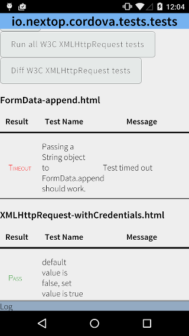
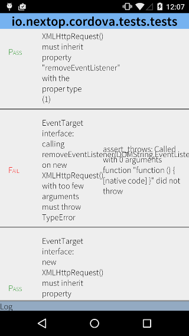

#  Things you can do with a Custom XMLHttpRequest

By Brien Colwell <<brien@nextop.io>>

At Nextop we're rethinking a CDN for mobile. In high latency and
shaky networks, we're building a network stack that can get content on the screen faster,
and never lose a transaction. A question keeps coming up -
can a custom network SDK work with webview or hybrid apps? I built a
  Cordova plugin, [io.nextop.cordova](http://plugins.cordova.io/#/package/io.nextop.cordova), to experiment with what can be done.
I wanted to share what I learned. In short, yes, with some JS, a custom network SDK can be deeply integrated
into a hybrid app.

The idea of the plugin is to clobber `window.XMLHttpRequest` with a function that calls into
the native plugin. Running a custom XHR in your app is like tinkering with your radio in space,
so the clobbered version has a prototype property `XMLHttpRequest` (`XMLHttpRequest.prototype.XMLHttpRequest` or
 `myXhr.XMLHttpRequest`) that can get you back the original XHR in an emergency. The Nextop XHR falls back to
 the original if the request fails.

One of the first stops I made when building the plugin was thinking about how to test it.
[W3C publishes a test suite for XHR](https://github.com/w3c/web-platform-tests/tree/master/XMLHttpRequest), and with a Jasmine manual test I was able to run a diff
of the results of Nextop XHR versus the original XHR. If you're curious how
to include parts of the W3C tests in your suite, [take a look at this tests.js](https://github.com/nextopio/nextop-client/blob/master/cordova/tests/tests.js).




All parts of XHR can be re-routed to the plugin via exec except requests with `sync=true`.
I don't think it's possible to block the main thread and receive an async callback from
Cordova on the main thread. That is, unless there is a synchronous handoff
between the webview and native, it seems like a deadlock to wait for a condition that
requires work on the main thread while blocking the main thread. So `sync=true`
just uses the original XHR.

So with some confidence that it works, I started thinking about how to integrate it deeper into the code.
All of the XHR calls now went through a custom network SDK, but what about ``,
`<script src="">` and other elements with linked network resources?

Webviews support inlining the result of a network request in src attributes, using a data: scheme with a content type and base64-encoded string.
 For example, `` is interpreted as if the network request was made
 and returned Content-Type: image/jpeg, and the content. With a [MutationObserver](https://hacks.mozilla.org/2012/05/dom-mutationobserver-reacting-to-dom-changes-without-killing-browser-performance/)
 a simple script can take over loading of `src` attributes.


```javascript
var rootObserver = new MutationObserver(function(mutations) {
    mutations.forEach(function(mutation) {
        if ('childList' == mutation.type) {
            mutation.addedNodes.forEach(function(node) {
                if ('IMG' == node.tagName) {
                    attachNextopImageLoader(node);
                } else if ('SCRIPT' == node.tagName) {
                    attachNextopLoader(node, 'src');
                }
            });
            mutation.removedNodes.forEach(function(node) {
                if ('IMG' == node.tagName) {
                    detachNextopLoader(node);
                } else if ('SCRIPT' == node.tagName) {
                    detachNextopLoader(node);
                }
            });
        }
    });
});

rootObserver.observe(document.body, {
    subtree: true,
    childList: true,
    attributes: false,
    characterData: false
});


function attachNextopImageLoader(img) {
    attachLoader(node, 'src', loadImage);
}

function attachNextopLoader(node, attrName) {
    attachLoader(node, attrName, load);
}

function attachLoader(node, attrName, loader) {
    /* listen to changes in the src attribute and cancel pending requests + reload */
}

/* detachNextopLoader cancels all requests */
```
(see [Nextop.js]())

The shiv uses a translation table to store a state on each node, so pending requests for that node can be canceled if the
node is removed from the view.

One great aspect of the loading shiv is that loading an image does not have to load just one image. It can load
a small preview then load the image. An optimized network stack will prioritize all the requests,
including the size and encoding of the preview, to get pixels on the page faster.

With the custom XHR and automatically replacing the src attribute for images and scripts,
this shows how a custom network SDK can be deeply integrated into a hybrid app.

Please reach out to me with questions/comments or [continue the conversation on GitHub](https://github.com/nextopio/nextop-client).


