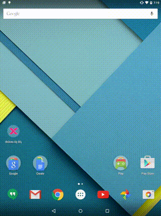

# Faster Image Loading on Android is now a one-liner

[](03.02.2015.assets/c.mp4) 
[](03.02.2015.assets/a.mp4)

The difference between the left and right is one line of code in the layout XML:

```xml
<io.nextop.view.ImageView />
```

Not mutually exclusive of Volley `NetorkImageView` or Picasso, the Nextop `ImageView`
sits on top of a reworked network protocol much like HTTP/2 [1]**.
Separate images get streamed to
the device like a combined movie instead of as separate request-responses. Because the protocol
can prioritize which bytes get to the client first, thumbnails of the image are put 
at the front of the queue to speed up loading a usable view.

Normally a developer would have to spend time resizing images and integrating a CDN. 
With Nextop a developer doesn't have to make any changes. Nextop optimizes the entire path from your server to putting to pixels on the screen with an SDK.

Get it from Maven Central with a gradle dependency:
```
compile 'io.nextop:android:+@aar'
```

## How does it work without changing your backend? 

Nextop built a new network client for Android. It's secret sauce is the ability for new parts to plug in. 
[Some parts might be developer and QA tools to condition your network](http://qr.ae/EMeBB). Other parts might be a new protocol.
The reason all this works together is that **messages never get lost in Nextop**. This is a fundamental
 shift from most network client libraries that give up after some number of retries. In Nextop,
 if one path to the server goes down, messages get re-routed to another path, or held in between like an airplane.

The Nextop protocol plugs in and talks to a proxy that translates requests to your backend.


 
Retries are really hard to get right, but we've solved it in a couple of clever ways:

- [Network requests can be attached to views via Rx](02.13.15_SUBSCRIPTIONS_NETWORKING_VIEWS.md). When the views go off screen,
  requests without side-effects are dropped. They are started again when the view 
  comes back on screen.

- Ordering is a first-class concept in the library. Messages are attached to groups with strict ordering the default,
  and groups are prioritizes relative to each other. The library provides a number of options
  to optimize behavior within the group (to give the option to handle head-of-line blocking better).
  This means no more question marks about how retry of multiple messages will behave. 

[Nextop is an open source project to give developers better networking.](https://github.com/nextopio/nextop-client)

We want to hear from you.
<support@nextop.io>

** Nextop will support HTTP/2 in a near release. The Nextop protocol has its own merits, as it resumes downloads/uploads where they left off after the network cuts out.
